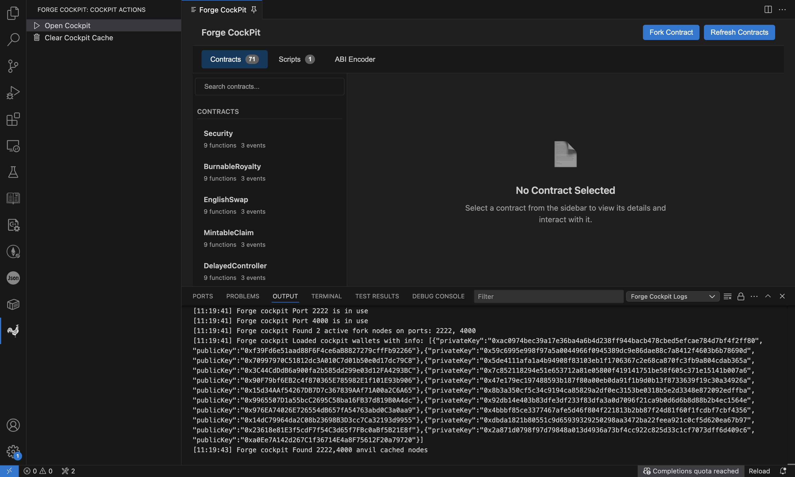
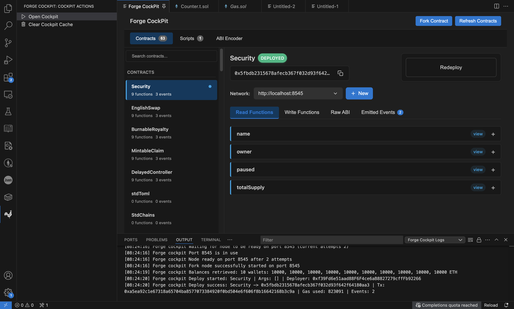
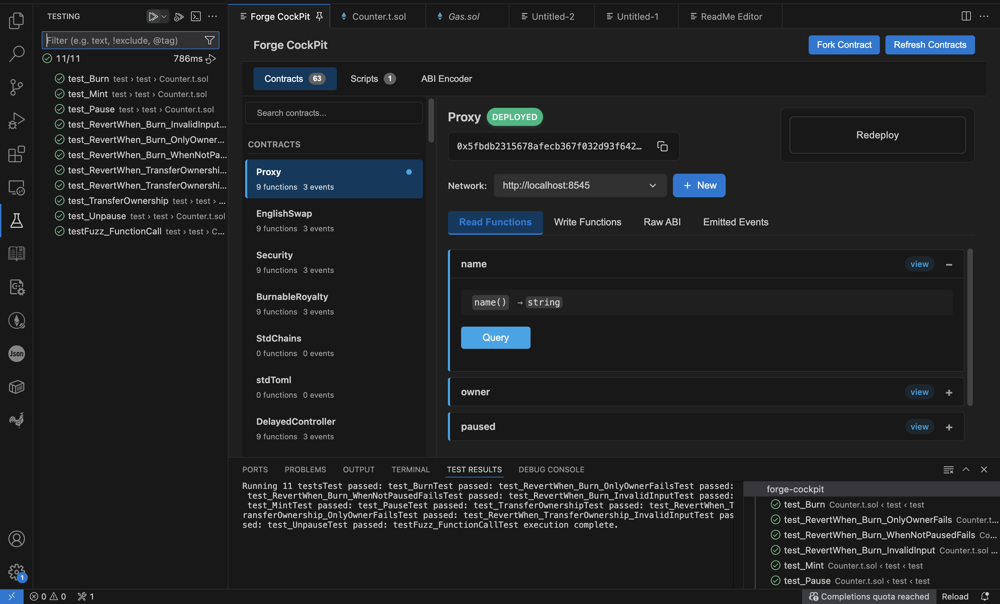
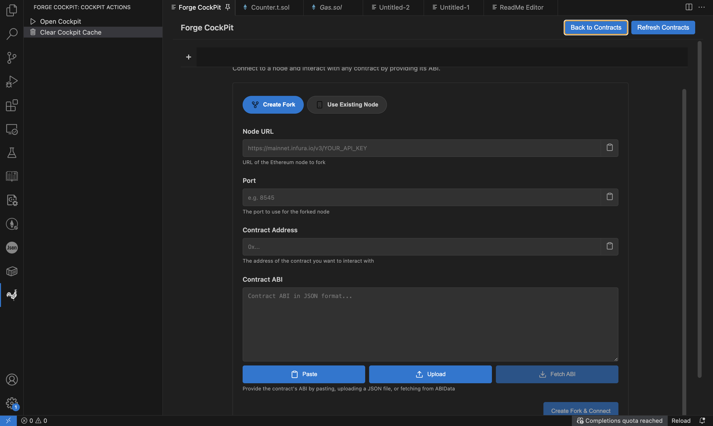

# Forge Cockpit


This is a Proof of Concept extension inspired by [EmbarkJS](https://github.com/embarklabs/embark/tree/master) more specifically the EmbarkJS cockpit. This extension experiments with introducing a User Interface for interacting with Anvil, deploying scripts as well as provides a test runner and stubber for your smart contracts.

[](https://marketplace.visualstudio.com/items?itemName=siphamandlamjoli.forge-cockpit)
[](https://marketplace.visualstudio.com/items?itemName=siphamandlamjoli.forge-cockpit)
[](LICENSE)
[](https://getfoundry.sh/)
[](https://soliditylang.org/)

## Features

- **Anvil Management**: Create and manage local and forked Anvil instances
- **Contract Deployment**: Deploy contracts directly to running instances
- **Contract Interface**: Generate Etherscan-like interfaces from contract ABIs
- **Contract Interaction**: Read from and write to deployed contracts through the generated interface
- **Test Generation**: Stub contract tests for deployed contracts
- **Test Runner**: Execute Forge tests with integrated runner
- **Code Lens**: Run individual Forge tests directly from the editor









## Requirements

- [Foundry](https://getfoundry.sh/) installed and available in PATH
- Active workspace with Foundry project structure

## Installation

Install from the VS Code marketplace or build from source.

## Usage

1. Open a Foundry project in VS Code
2. Use the command palette to access Forge Cockpit commands
3. Create an Anvil instance (local or forked)
4. Deploy contracts and interact through the generated interface

## Configuration

### Account Management

Create a `cockpit-accounts.json` file in your project root to configure accounts for use with the extension:

```json
{
  "accounts": {
    "Private_key1": "Public_key1",
    "Private_key2": "Public_key2",
    "Private_key3": "Public_key3",
    "Private_key4": "Public_key4",
    "Private_key5": "Public_key5"
  }
}
```

The format maps private keys to their corresponding addresses. These accounts will be available for contract deployment and interaction within the extension. Alternatively you can use the in built import function.

> **Security Note**: Only use test accounts and never use real accounts

## FAQ

**Q: Can I use this with mainnet forks?**
A: Yes, you can create forked Anvil instances that fork from mainnet or other EVM chains.

**Q: Can I use this in production?**
A: No, this is designed for development environments only with local Anvil instances.

## Known Issues

As this is an experimental extension there maybe issue outside of the known

- Getting events after a transaction may fail due to max limit of 5K for fetching events
- There are instances where the extension UI refuses to, the solution to this requires reloading the vscode window.

## Release Notes

### 1.0.0

Initial proof of concept release

---

**Note**: This is a proof of concept extension. Use in development environments only.
