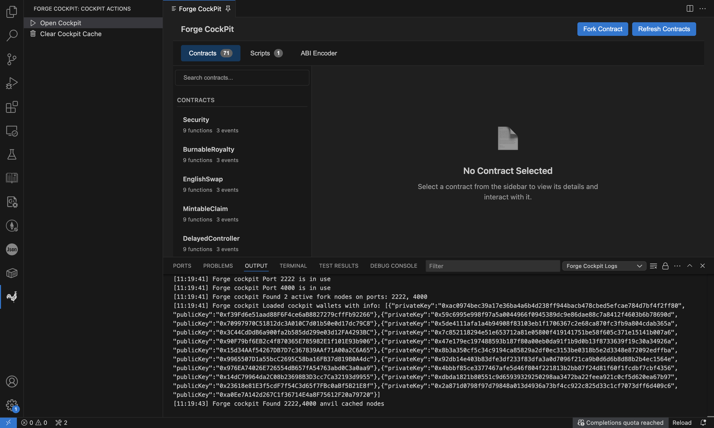
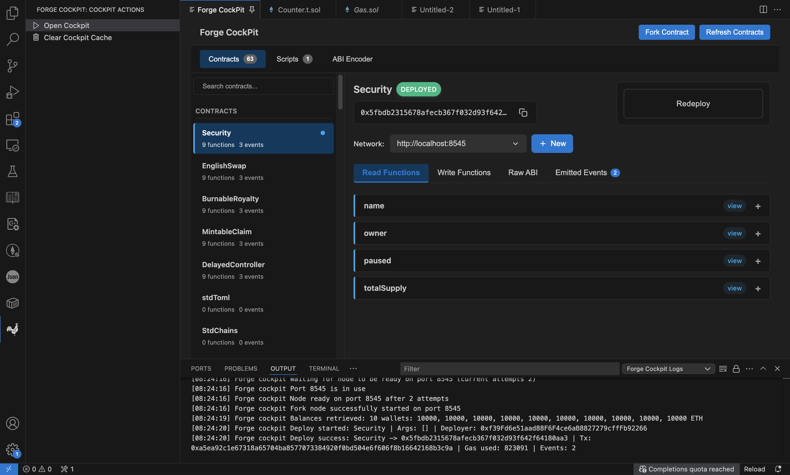
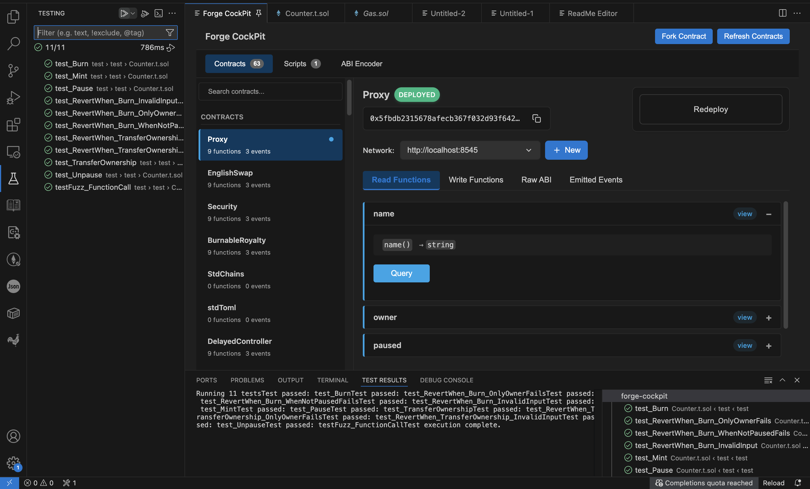
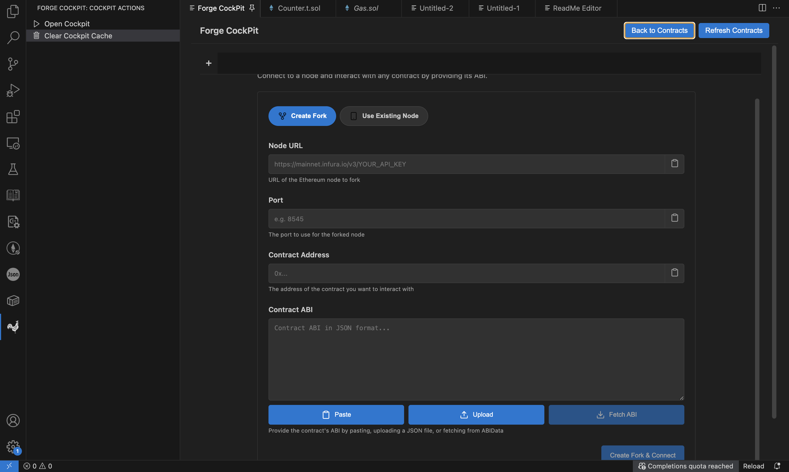

# Forge Cockpit


Forge Cockpit is a VS Code extension for Foundry projects inspired by [EmbarkJS](https://github.com/embarklabs/embark/tree/master), especially the Embark cockpit workflow. It adds a Cockpit UI for managing Anvil nodes, deploying and interacting with contracts, running Forge tests, and generating scaffold files for tests and deployment scripts.

[](https://marketplace.visualstudio.com/items?itemName=siphamandlamjoli.forge-cockpit)
[](https://marketplace.visualstudio.com/items?itemName=siphamandlamjoli.forge-cockpit)
[](LICENSE)
[](https://getfoundry.sh/)
[](https://soliditylang.org/)

## Features

- **Cockpit UI**: Manage contracts, scripts, ABI encoding, wallets, and Anvil nodes from one panel
- **Anvil Management**: Create and manage local and forked Anvil instances
- **Contract Deployment**: Deploy contracts directly to active local nodes
- **Contract Interaction**: Read from and write to deployed contracts through a generated interface
- **Script Execution**: Run Foundry deployment scripts against active nodes
- **Manual Artifact Rebuilds**: Mark artifacts stale on source changes and rebuild on demand instead of rebuilding on every file change
- **Upgrade-Aware Scaffolds**: Generate test stubs and deployment script stubs for regular and upgradeable contracts
- **OpenZeppelin Foundry Upgrades Support**: Scaffold upgrade flows using `openzeppelin-foundry-upgrades` when upgrade patterns are detected
- **Test Runner**: Execute Forge tests with integrated single-test and grouped test actions
- **Code Lens**: Run Forge tests, generate stub tests, and generate deployment script stubs directly from the editor
- **Cockpit Settings Panel**: Adjust Cockpit-managed settings like test verbosity inside the webview









## Requirements

- [Foundry](https://getfoundry.sh/) installed and available in PATH
- Active workspace with Foundry project structure

## Installation

Install from the VS Code marketplace or build from source.

## Usage

1. Open a Foundry project in VS Code
2. Open Forge Cockpit from the sidebar or command palette
3. Create an Anvil instance or select an active node
4. Rebuild artifacts when the project is stale using `Rebuild Project`
5. Deploy contracts, run scripts, or interact with deployed contracts through the Cockpit UI
6. Use code lenses to run tests or generate test and deployment scaffolds

## Configuration

### Cockpit Settings

Forge Cockpit exposes extension settings through both VS Code Settings and the Cockpit `Settings` panel.

- `forge-cockpit.testVerbosity`
  Controls the default verbosity flag used by Cockpit-triggered Forge test runs.
  Supported values: `-v`, `-vv`, `-vvv`, `-vvvv`, `-vvvvv`

The Cockpit also displays read-only project configuration sourced from `foundry.toml`, including:

- `src`
- `test`
- `script`
- `out`
- `via_ir`

Scaffolded test files are written into the configured Foundry `test` directory, and scaffolded deployment scripts are written into the configured `script` directory.

### Account Management

Create a `cockpit-accounts.json` file in your project root to configure accounts for use with the extension:

```json
{
  "accounts": {
    "Private_key1": "Public_key1",
    "Private_key2": "Public_key2",
    "Private_key3": "Public_key3",
    "Private_key4": "Public_key4",
    "Private_key5": "Public_key5"
  }
}
```

The format maps private keys to their corresponding addresses. These accounts will be available for contract deployment and interaction within the extension. Alternatively you can use the in built import function.

> **Security Note**: Only use test accounts and never use real accounts

## FAQ

**Q: Can I use this with mainnet forks?**
A: Yes, you can create forked Anvil instances that fork from mainnet or other EVM chains.

**Q: Can I use this in production?**
A: No, this is designed for development environments only with local Anvil instances.

## Known Issues

As this is an experimental extension there maybe issue outside of the known

- Getting events after a transaction may fail due to max limit of 5K for fetching events

## Release Notes

### 2.0.0

- Added explicit rebuild-driven artifact management instead of rebuilding on every source change
- Added Cockpit settings for test verbosity and surfaced Foundry project paths in the UI
- Added deployment script scaffold generation and smarter upgrade-aware scaffold generation
- Improved local node handling, wallet interactions, and test command reliability

### 1.0.0

Initial proof of concept release

---

**Note**: This is a proof of concept extension. Use in development environments only.
